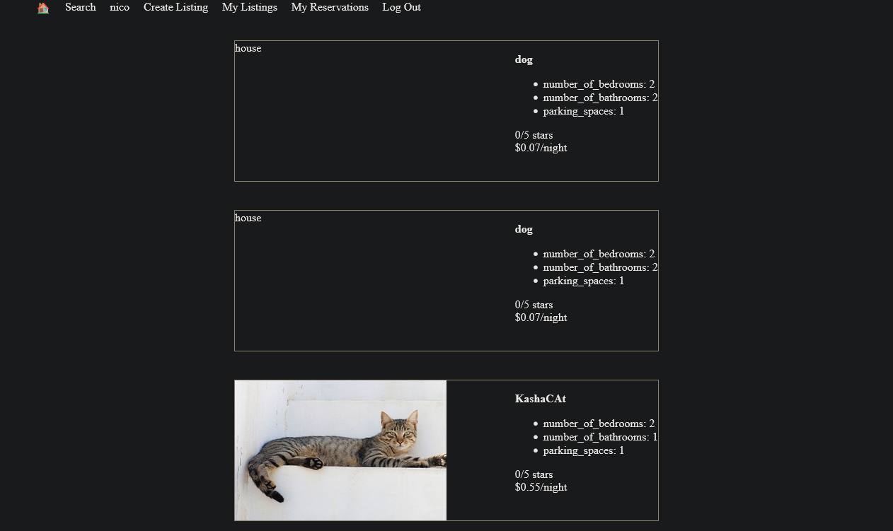
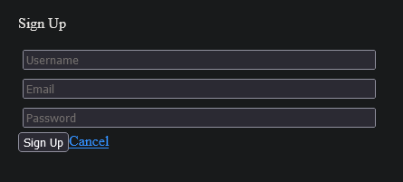

# LightBnb 
## A Revolutionary Way To Vacation

LightBnb is a scaled down, AirBnB lite.

You can create your own account, check properties, add/list properties while using the front end!
Best of all, it runs locally! It is built using JS, Express, and PostgreSQL.

## Dependancies
- Quiet a few things, so follow the instructions below.
- This also implies you have the correct database and tables from `migrations/` and `seeds/`

## Getting Started
1. Clone the following repository into your local device
`git clone git@github.com:nicoayamen/lightbnb.git`
 
2. Move into the `LightBnB_WebApp` directory from the `lightbnb/` directory
`cd lightbnb/` and then `cd LightBnB_WebApp`

3. Install the dependencies with `npm install`

4. Once the process is finished, run the server
`npm run local`

5. The server runs on port 3000, so make sure that port is open

6. Enjoy your vacation!

## Final Product

